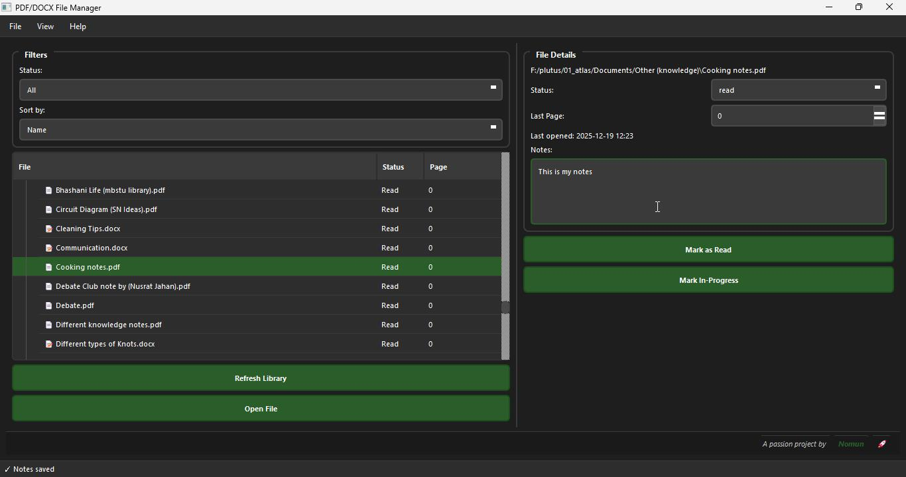
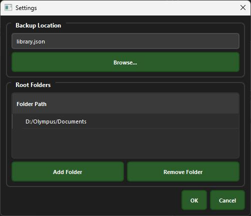
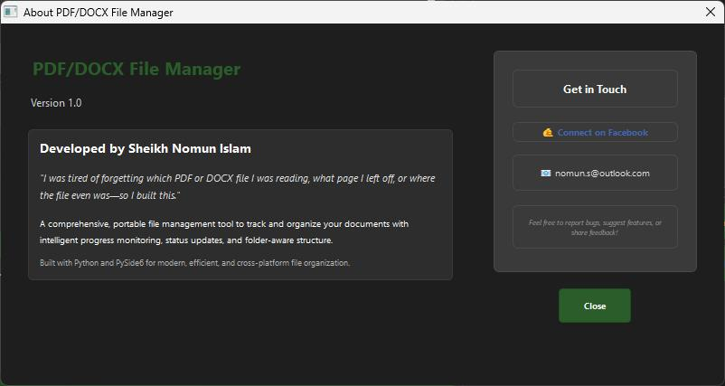

# PDF/DOCX File Manager

A portable Windows application for managing, tracking, and organizing PDF and DOCX files across multiple folders.

## Features

### Core Functionality
- **Cross-Folder Library Management**: Track files across multiple root folders with automatic subfolder scanning
- **File Status Tracking**: Mark files as Unread, In-Progress, or Read
- **Progress Tracking**: Track the last page read for each file
- **Automatic File Opening**: Opens files in default Windows applications (Word, Edge, etc.)
- **Progress Prompts**: Automatic popup after closing files to update reading progress
- **Duplicate & Missing File Handling**: Smart detection of moved files to preserve progress
- **JSON Data Storage**: All data stored in a portable JSON file with backup location selection

### User Interface
- **Dark Theme**: Modern dark interface with green accent colors
- **Tree View**: Organized display showing original folder structure
- **Filtering & Sorting**: Filter by status, sort by name/status/last opened
- **File Details Panel**: View and edit file status, progress, and notes
- **Settings Panel**: Manage root folders and backup locations

### Advanced Features
- **Real-time File Monitoring**: Automatic detection of file changes (requires watchdog)
- **Portable Design**: Single executable, no installation required
- **Offline Operation**: Works completely offline, no internet required
- **Extensible JSON Format**: Future-proof data structure for adding new features

## Screenshots

### Main Window


### Settings


### About


## Installation & Setup

### Prerequisites
- Windows 10/11
- Python 3.8+ (for building from source)

### Option 1: Download Pre-built Executable
1. Download `PDFDocxManager.exe` from releases
2. Run the executable directly - no installation required
3. The app will create a `library.json` file in the same directory

### Option 2: Build from Source

#### Windows
1. Clone or download the source code
2. Install Python 3.8+ if not already installed
3. Run the build script:
   ```batch
   build.bat
   ```
4. The executable will be created in `build_output/PDFDocxManager.exe`

#### Linux/Mac
1. Clone or download the source code
2. Make the build script executable:
   ```bash
   chmod +x build_linux.sh
   ```
3. Run the build script:
   ```bash
   ./build_linux.sh
   ```
4. The executable will be created in `build_output/PDFDocxManager`

## Usage

### First Run
1. Launch the application
2. Go to File → Settings
3. Add root folders to track by clicking "Add Folder"
4. Choose a backup location for your library.json file
5. Click "Refresh Library" to scan for files

### Managing Files
- **Adding Folders**: Use Settings → Add Folder to include new directories
- **Viewing Files**: Files are displayed in a tree structure matching your folder organization
- **Opening Files**: Double-click files or use "Open File" button
- **Updating Progress**: After closing a file, enter the last page you read
- **Changing Status**: Use the dropdown in the file details panel or quick action buttons

### Filtering and Organization
- **Status Filter**: Show only Unread, In-Progress, or Read files
- **Sorting**: Sort by filename, status, or last opened date
- **Search**: Use the tree view to navigate through your folder structure

### Data Management
- **Backup**: Your library.json file contains all progress data
- **Portability**: Move the executable and JSON file together to any location
- **Recovery**: If files are moved, the app will prompt you to confirm if it's the same file

## File Structure

```
PDFDocxManager.exe          # Main executable
library.json               # Your file tracking data (created on first run)
```

### Sample JSON Structure
```json
{
  "version": "1.0",
  "folders": [
    "D:/Documents/Knowledge",
    "E:/Books"
  ],
  "files": [
    {
      "id": "Knowledge/AI_Research/notes.pdf",
      "full_path": "D:/Documents/Knowledge/AI_Research/notes.pdf",
      "status": "in-progress",
      "last_page": 45,
      "last_opened": "2025-07-24T21:30:00",
      "notes": "Important research paper on neural networks"
    }
  ],
  "settings": {
    "theme": "dark",
    "auto_refresh": true,
    "backup_location": ""
  }
}
```

## Technical Details

### Built With
- **PySide6**: Qt-based GUI framework
- **Watchdog**: File system monitoring
- **PyInstaller**: Executable packaging

### File Types Supported
- PDF (.pdf)
- Microsoft Word Documents (.docx)

### System Requirements
- Windows 10/11 (primary target)
- ~50MB disk space for executable
- Minimal RAM usage (typically <100MB)

### Security & Privacy
- **No Internet Required**: Completely offline operation
- **No Data Collection**: All data stays on your local machine
- **No Installation**: Portable executable with no system modifications

## Troubleshooting

### Common Issues

**Files not appearing in library**
- Ensure the folder path is correct in Settings
- Click "Refresh Library" to rescan
- Check that files have .pdf or .docx extensions

**Progress not saving**
- Verify the JSON backup location is writable
- Check that the library.json file isn't set to read-only

**File won't open**
- Ensure you have appropriate software installed (Adobe Reader, Microsoft Word, etc.)
- Check that the file hasn't been moved or deleted
- Try opening the file manually from Windows Explorer

**App crashes on startup**
- Delete library.json to reset to defaults
- Ensure all folder paths in the JSON are valid
- Run from command line to see error messages

### Performance Tips
- Avoid adding extremely large folder trees (>10,000 files)
- Use specific subfolders rather than entire drives as root folders
- Regularly clean up old/moved files from your library

## Future Enhancements

The JSON format is designed to support future features:
- File tags and categories
- Reading time tracking
- Export/import functionality
- Cloud sync capabilities
- Advanced search functionality
- Reading statistics and reports

## License

This software is provided as-is for personal use. Feel free to modify and distribute according to your needs.

## Support

For issues or feature requests, please check the documentation or create an issue in the project repository.